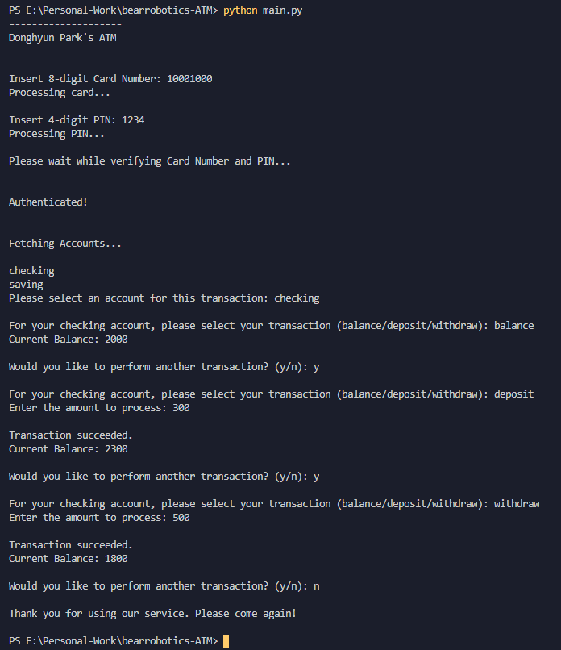
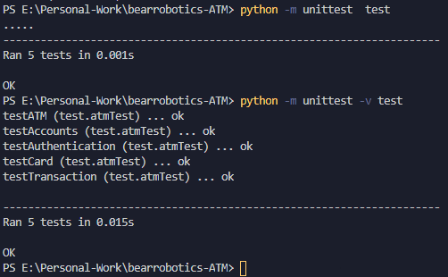

# 베어로보틱스 ATM Controller 프로젝트

이 프로젝트는 2020년 베어로보틱스코리아 겨울 백엔드 개발자 인턴 채용 (Winter Internship Program) 건을 위해서 만들어 졌습니다 <br />
An ATM controller application for 2020 BearRobotics Winter Internship Application

## Clone 다운로드

(PowerShell, Terminal)과 비슷한 Shell을 통해서 아래 커맨드를 복사 및 실행 <br />
Using a shell, clone this repository using the following command

```
$ git clone https://github.com/dhyunpark/bearrobotics-ATM.git
```

## Run 실행

프로그램을 실행 시 아래 조건이 필요 <br />
The following requirements are necessary to run this demo application

```
python 3
```

프로젝트의 루트 디렉토리에 들어간 뒤 아래 커맨드를 복사 및 실행 <br />
Enter root directory of the project and execute the following command

```
$ python main.py
```

### 가정 Assumptions

ATM은 10,000의 돈을 보유하니 그 이상의 출금은 불가능 <br />
The ATM only holds 10,000 units of money so any amount higher will result in an error

가짜 은행 정보를 사용하니 아래의 카드 번호와 핀 넘버만 사용 가능 <br />
Since the project uses a fake bank information, the available card numbers and PIN are

```
1. 12345678/2468
2. 10001000/1234
3. 20002000/0000
```

기록이나 보안적인 요소는 제외함 <br />
Records or security concerns are not considered within the scope of this project

### 예시 Demo Run

<br />

## Test 테스트

프로그램을 실행 시 아래 조건이 필요 <br />
The following requirements are necessary to run this demo application

```
python 3
```

프로젝트의 루트 디렉토리에 들어간 뒤 아래 커맨드를 복사 및 실행 <br />
Enter root directory of the project and execute the following command

```
$ python -m unittest test.py
```

추가정보를 원한다면 -v 플래그를 쓰면 됨 <br />
If more detail is desired, use the -v flag

```
$ python -m unittest -v test.py
```

### 예시 Demo Run

<br />
